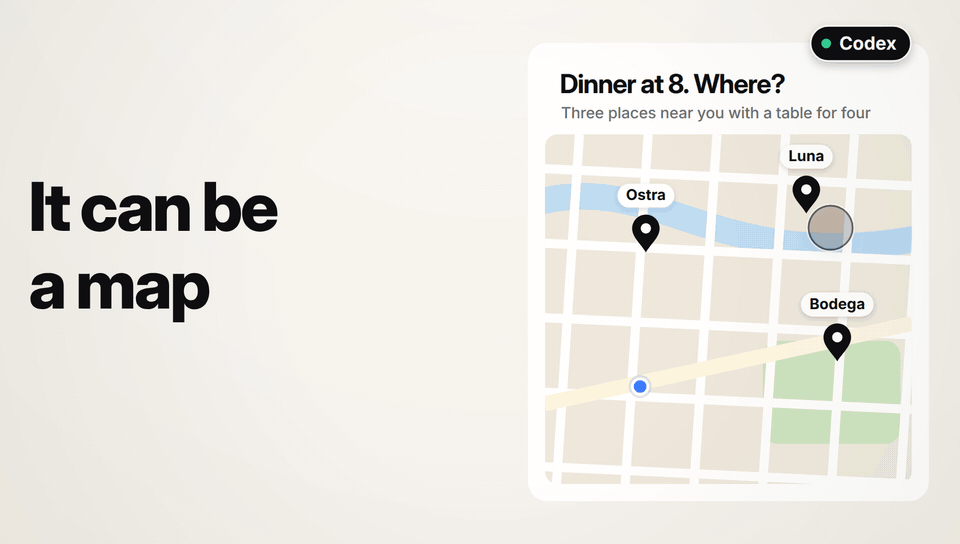

# It

It lets an AI agent put a live, interactive page on any screen you own, and what you do on that page goes back into the conversation that made it.

An agent's answer in a chat is text, and a decision it asks you for there is a paragraph that you answer with another. With It, the agent writes a page instead, shows it on your laptop, your phone or your TV, and you answer by using it.

- **A question becomes a page you can answer.** An agent that needs a decision builds the page that fits it: the plan itself with an Approve button on it, three options side by side, a form with a Submit. You choose once, and the agent hears what you decided.
- **A page stays current.** The agent changes what a page shows without publishing it again, so a dashboard on the screen in your kitchen follows the work as it goes.
- **You can answer from another room.** A phone, a tablet or a TV on your network becomes a screen in three steps, and an approval you give on your phone reaches the agent that is waiting for it.
- **A click waits for the agent.** What you do on a page is kept for the agent, for up to a month, so it is not lost when the conversation has gone quiet. In Claude Code and in Codex it starts a turn there by itself.

## Why It is different

It runs on your own computer, with no account anywhere and no service to sign up for. Your pages, and what you do on them, stay in one folder there.

It is one program. The same `it` is the service that shows your pages and the command an agent publishes them with.

It works with the agent apps you already use, and brings no agent of its own. What you do on a page goes to the conversation that made it, and where that conversation has been closed, It reopens it for you, and the page's bar lets you stop it. That is Auto-wake: it is on for each agent app you connect, and you turn it off on the site's Machines page. It has add-ons for Claude Code, Codex, Pi, OpenCode and Hermes Agent, which are proven end to end against the real programs, and one for OpenClaw, which is proven for a conversation held in OpenClaw itself and not yet in a chat channel. Any other agent can drive It with the `it` command. [Agents](docs/agents.md) says exactly what works where.

A page an agent wrote is kept apart. It cannot reach the site that shows it, your pairing, or another page, and nothing is shown to a browser until you have paired it.

## Install

```sh
curl -fsSL https://itcan.do/install.sh | sh        # macOS and Linux
irm https://itcan.do/install.ps1 | iex             # Windows
```

Each command downloads one program for your system, checks it against its published checksum and puts it in `~/.it/bin`. It asks for no administrator rights and installs nothing else. At a terminal it goes straight on into the setup.

## The first two minutes

1. The setup leads you through. It starts It in the background, connects the agent apps you tick, asks how you will reach It (this computer, your home network, or Tailscale), and pairs your first screen: your browser opens, or you scan a code with your phone. `it setup` runs it again at any time.
2. Say "Give me the It tour" to your agent. It puts a handful of things on your own screen (a whiteboard, a chessboard, a checklist, a drum machine, a big red button), and plays along with whichever you pick.
3. Ask for something of your own to look at: "show me the plan as a page I can approve", or "put the test results on my screen and keep them current".
4. Use the page. What you do arrives in the agent's conversation, and the page shows what the agent made of it.

## Read more

- [Installing It, and the first run](docs/install.md)
- [Screens](docs/screens.md): pairing a phone, a tablet or a TV, and the network
- [Agents](docs/agents.md) and [add-ons](docs/add-ons.md): which agent apps It connects, and what to expect of each
- [What It keeps](docs/data.md): where your pages are, for how long, and how to erase everything
- [Network and privacy](docs/network-and-privacy.md): what leaves the machine, and the ports It uses
- [What It protects, and what it does not](docs/what-it-protects.md)
- [When something does not work](docs/troubleshooting.md)
- [Contributing](docs/CONTRIBUTING.md), and how to [report a security problem](docs/SECURITY.md)

## What It is, and what it is not

It is made for one person, on their own computer and their home network. It is not made for the public internet: it speaks plain `http` and has no defence built for strangers at its door, and [What It protects, and what it does not](docs/what-it-protects.md) lists every limit, which is worth reading before you turn its network on. It has been used on Linux, and on macOS and Windows only on test machines so far.

It reports counts of how it is used, under a random id and never what is on a page, unless you turn that off with `it telemetry off`. [Network and privacy](docs/network-and-privacy.md#usage-counts) says what is sent.

It is source-available under the [It License](LICENSE.md), which [What the It License lets you do](docs/licensing.md) explains with examples. The work of others that It includes is listed in [the third-party notices](THIRD_PARTY_NOTICES.md).
